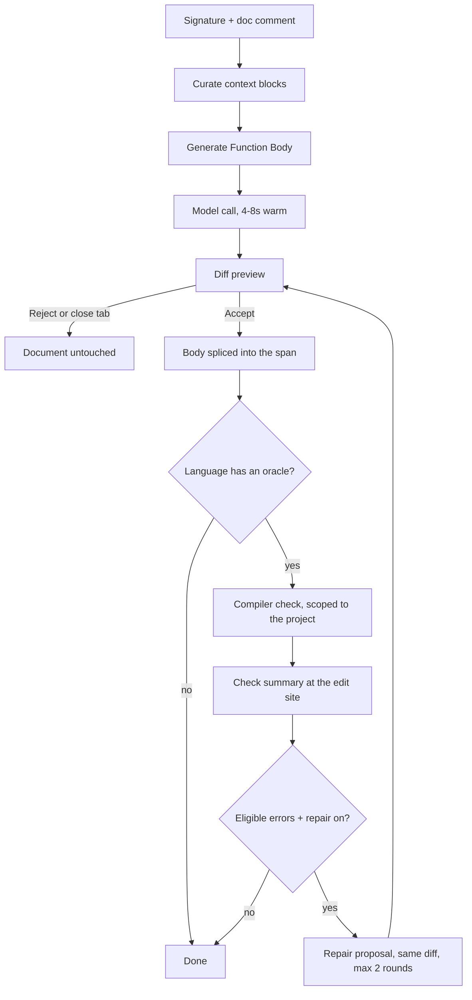

**_ WARNING LLM GENERATED [TODO REWRITE] _**

# Column 80: user manual

Column 80 is a VS Code extension with two model paths and nothing else: FIM tab-completion as you type, and per-function generation on demand. Both run against local models through Ollama by default. Nothing is indexed, nothing is retrieved behind your back, and no prompt sails to a cloud unless you set a cloud provider yourself.

You design, it types. The tool is constrained on purpose so you never stop being the person who understands the code.

What it will not do, ever: agent mode, chat panel, MCP, repo indexing, automatic context retrieval, telemetry. The prompt is a deterministic function of your cursor and the context blocks you added by hand.

Five languages ride the full stack: **Rust, Go, TypeScript/JavaScript, C#, Python**.

## Find what you need

| You want | Go to |
|---|---|
| Get it running from zero | [Install and first run](#install-and-first-run) |
| Nothing is happening | [It is not working](#it-is-not-working) |
| Understand the ghost text | [FIM tab-completion](#fim-tab-completion) |
| Say what the next line does instead of typing a comment | [Dictate the next block](#dictate-the-next-block) |
| Generate a function body | [Function generation](#function-generation) |
| Control what the model sees | [Context blocks](#context-blocks) |
| Compile errors and auto-repair | [Compiler check and repair](#compiler-check-and-repair) |
| Make the model match your codebase style | [Refine](#refine-repair-on-a-clean-build) |
| Generate unit tests | [TDD tests](#tdd-tests) |
| Run the tests your repo already has | [Covering tests](#covering-tests) |
| Repair a function from a failing test | [Repair from a failing test](#repair-from-a-failing-test) |
| Grade a function against a rubric | [Criticize](#criticize) |
| Have a model review a function | [Review Function (model)](#review-function-model) |
| Use Claude/GPT/Gemini instead of local | [Cloud function generation](#cloud-function-generation) |
| Use your Claude subscription, no API key | [Claude Code](#claude-code-subscription-not-an-api-key) |
| Read the logs | [The output channel](#the-output-channel) |
| Every setting | [Settings](#settings) |
| Every command | [Commands and keys](#commands-and-keys) |
| What is broken or missing | [Known limits](#known-limits) |

## What runs where

Per language, so you know what you get before you install.

| | Rust | Go | TS/JS | C# | Python |
|---|---|---|---|---|---|
| FIM ghost text | yes | yes | yes | yes | yes |
| Surface injection (real members in the prompt) | yes | yes | yes | yes | yes |
| Member-name output gate | no | no | yes | yes | yes |
| Function generation | yes | yes | yes | yes | yes |
| Type generation (struct/enum/class/interface) | yes | yes | yes | yes | yes |
| Compiler check after accept | `cargo check` | `go build` | project's `tsc` | `dotnet build` | bundled pyright |
| Gated repair | yes | partial (see limits) | yes | yes | yes |
| TDD test generation | yes | yes | yes | yes | yes |
| Test runner rung | libtest | `go test` | vitest, jest | MSTest, xUnit, NUnit | pytest, unittest |
| Covering-test discovery | crate | module | no (see limits) | project | project |
| Repair from a failing test | yes | yes | no | yes | yes |

Any other language: FIM only, and only if you add its language id to `column80.fimLanguages`. See [Where FIM runs](#where-fim-runs).

## Install and first run

### Requirements

- [Ollama](https://ollama.com) on `http://localhost:11434`. FIM always runs against this box, so you need it here even if the big model lives elsewhere. `column80.apiBase` re-points function generation: another port on this machine takes both halves with it, another machine takes function generation only.
- VS Code 1.85 or newer to install. **1.130 or newer** if you want the scoped-ghost gesture in C# and TypeScript: 1.124 never re-requests inline completions when the suggest selection changes, so the gesture is silently dead there.
- An NVIDIA GPU for function generation. No GPU still gets you FIM, labelled honestly.
- Your language's own toolchain for the compiler check: `cargo`, `go`, a project-local `node_modules/typescript`, `dotnet`. Python needs no pyright install, it ships inside the extension, but it does want a `.venv` or `venv` beside your project root. Without one the check falls back to system python and you get a missing-imports storm.
- **Your language's language server extension, installed and enabled**: rust-analyzer for Rust, the Go extension for Go, the C# extension for C#, Pylance for Python. TypeScript and JavaScript need nothing extra, VS Code ships theirs. Every gesture past FIM asks it for document symbols, so without one, generate, repair and TDD all refuse. FIM keeps working, which is what makes a missing server look like a working install.

### The first-run flow

On activation the extension probes your hardware and offers a tier. Nothing downloads without your click.

1. **Probe.** One `nvidia-smi` spawn plus a RAM read, SIGKILLed at 3 seconds so activation cannot hang. No GPU, no driver, WSL without passthrough: all land on the FIM-only tier instead of guessing.
2. **Tier offer.** A picker with the detected tier preselected and every tier available as an override. Take the default and `hardwareTier` stays `auto`, so new hardware re-adapts. Pick explicitly and it persists.
3. **Ratified downloads.** One click per model your tier needs and your disk lacks. Decline and nothing changes; the message names what stays disabled and that **Column 80: Select Hardware Tier** is the way back.

If Ollama is down the flow offers to run `ollama serve` in a visible terminal, then tells you to re-run Select Hardware Tier once it is up. That command re-runs everything, any time.

FIM completion is **on by default** (`column80.enabled: true`). With no model pulled and no Ollama running it stays silent rather than erroring at you.

### The tiers

| Tier | Hardware | Function-generation model | Notes |
|---|---|---|---|
| `24gb` | 20GB+ VRAM | `qwen3-coder:30b` | Both models fully on GPU, no carve. **Provisional**: never validated on real 24GB hardware, and the picker says so. |
| `16gb-large-ram` | 16GB VRAM, 32GB+ RAM | `qwen3-coder:30b`, layer-capped at `num_gpu=30` | The reference config and the only spike-proven row. FIM holds 102-109ms TTFT during alternation, the 30b holds 34.6 tok/s, zero model evictions. |
| `16gb-low-ram` | 12-16GB VRAM, or 16GB VRAM with low RAM | `qwen2.5-coder:14b-instruct-q4_K_M` (~9GB) | Both models fit resident, no carve needed. Weaker than the 30b, and real. |
| `below-12gb` | Under 12GB VRAM, or no usable GPU | disabled | FIM only, with an honest message instead of silent thrashing. |

FIM always uses `qwen2.5-coder:1.5b-base` on every tier.

**Why the carve exists.** On a 16GB card, default Ollama scheduling thrashes when a small FIM model and a big instruct model alternate: 2 to 4.6 second reloads per swap, measured. Over-allocating the big model is worse, because it silently pushes the FIM model to CPU, which looks like it works while destroying the latency. The tier computes an explicit GPU layer cap so both stay resident. There is no `num_gpu` setting, deliberately: a manual knob is an invitation to the exact silent-CPU-spill failure the tiers exist to prevent.

Set `fnGenModel` yourself and you take the carve with it: an explicitly set tag wins and drops the carve, because a layer count tuned for the 30b means nothing on a foreign tag.

**When you report a tier problem, name the quant.** These are Ollama's default tags. A bug report saying "16GB tier" is not checkable; "16GB tier, `qwen3-coder:30b` at Ollama's default quant" is.

**The probe reads total VRAM, never free.** A game or another LLM holding half your card still gets a carve sized for an empty card, and Ollama degrades with no warning from here. Free the VRAM or override the tier down.

### It is not working

In order, cheapest first.

1. Open the **Column 80** output channel (View > Output > Column 80). Every path logs. Silence there means the provider was never asked.
2. `[fim] no ghost: languageId=cpp is not code Column 80 understands` means your language is not served. Add its id to `column80.fimLanguages`.
3. `[fim] no ghost: the cursor is inside a <kind> comment` is the rule that keeps the model out of your specs. Working as designed.
4. No `[fim]` lines at all: `column80.enabled` is off, or another inline provider (Continue, Copilot) won the ghost slot. There is no detection for that yet.
5. Function generation refuses with a tier message: run **Column 80: Select Hardware Tier**.
6. Everything is slow: check `[fim] ttft=` in the channel. Warm TTFT consistently past 200ms usually means the FIM model got pushed off the GPU. Something else is eating VRAM, or the tier is wrong for the card's current free memory.
7. Set `column80.fimModel` to a chat model and you get garbage and lag. It must be a **FIM-capable base model**, not `-instruct`. A big chat model does not speak the FIM tokens.

## FIM tab-completion

Ghost text as you type, from the 1.5b base model. Always local, no cloud path, ever.

### Where FIM runs

Rust, C#, Python, Go and the TypeScript family (`typescript`, `typescriptreact`, `javascript`, `javascriptreact`). That list is exactly the languages carrying an oracle or a surface extractor, which is this product's own definition of "we understand this". Everything else, markdown and JSON and YAML and code in an unlisted language, is dark before any model call. Writing prose should not spend a model call per keystroke.

`column80.fimLanguages` widens the list and can never narrow it. Use VS Code language ids, not extensions: `cpp`, not `.cpp`. You get plain FIM there. The oracle, repair and surface injection stay dark, because there is nothing behind them for that language.

One caveat before you widen. The rule that keeps ghost text out of your comments reads a per-language comment table. That table is wide (C, C++, Java, Kotlin, Swift, Scala, PHP, Dart, Ruby, the shells, Lua, SQL, Haskell, Clojure and more) but it has not met everything. Widen to a language it has not met and you get FIM with comment protection off. The channel says so once:

```
[fim] comment rules dark: no comment syntax mapped for languageId=zig, so the in-comment refusal cannot run here
```

### How it behaves

- **Debounce.** A request fires 150ms after your last keystroke (`debounceMs`). Newer keystrokes cancel older pending requests; at most one model request is in flight.
- **Speed.** Measured floor on the reference box (RTX 5080): 103ms time-to-first-token, 140ms total. The bar is sub-200ms warm at 2-4K context.
- **Typing through is free.** Type the characters of a shown suggestion and each keystroke re-hits a local cache instead of the model. `cacheCapacity: 0` turns that off if you want every keystroke observable on its own.
- **Context window.** The last 3000 characters before your cursor and the first 1000 after (`prefixChars` / `suffixChars`). Never the whole file.
- **Manual trigger.** VS Code's **Trigger Inline Suggestion** (Alt+\ by default) skips the debounce.

### The bound: why ghosts are short

Plain FIM continues the line you are typing. It does not author a body.

Measured over 850 real sites in the five shipped languages: 83% of unbounded plain ghosts were multi-line, and of the 7,397 lines served past line 1, 208 were right and 7,189 were wrong. So a plain ghost is now cut to one content line, extended to the end of an unterminated statement or of a construct that line opens, capped at four content lines, and never cut at a dangling tail.

A declaration head is the visible case: at `fn parse(` the ghost serves the rest of the signature and stops on the open `{`, instead of writing you a whole function. That change alone took pooled p90 from 231ms to 186ms.

Two sites are exempt and may go multi-line, because they have real facts in front of them: a member site, and a whole-block site (empty function body) where injection resolved.

`[fim] ttft=... bound=<rule> kept=N dropped=N appended=N` on the channel tells you the bound fired. An exempt site says so, so a long ghost there reads as the exemption working.

### The length floor

A ghost too short to be worth reading is not shown. `minGhostChars` (8) and `minGhostAlnum` (2) carry JetBrains' published numbers. Over 750 real sites the floor refused 7 of 710 served ghosts (1.0%), and none of the 7 matched what the developer went on to write. A ghost ending on a block opener is exempt on length, since that is exactly the signature shape the bound produces. Set `minGhostChars: 0` to see everything.

### Comment rules

Two rules, both structural.

- **The ghost never introduces a comment.** A comment-led line cuts the ghost before it; a trailing comment is cut off and the code kept.
- **Inside a comment there is no ghost.** Your doc comment is your spec, and a model writing your spec is the one thing this product refuses. It runs before the service is asked, so it costs no model call.

### Injection: real facts in the prompt

At three site kinds the extension asks your already-running language server for the truth and puts it in the model's prefix. No rival server is ever spawned.

- **Member site** (right after `.` or `::`): the receiver's real member signatures, narrowed to what you have typed, capped so a 100-candidate firehose is skipped rather than injected as noise.
- **Whole-block site** (cursor in an empty function body): the types-in-play struct graph, so a generated body uses real field and method names.
- **Enum-RHS site** (C# only today, `t.Band == `): the enum's variant list, so the model writes `LodBand.Regional` instead of inventing `Band.Regional`.

Every query is raced against a **50ms deadline**. A cold or busy language server loses and the path falls back to plain FIM rather than blow the latency bar. The wait is folded into the reported TTFT, so the numbers stay honest.

**Backtick a type name in any comment and Column 80 resolves its surface into the prompt. Without backticks it is prose and is left alone.**

Write the type the way your language spells it. `` `*Config` ``, `` `&'a Config` ``, `` `dyn Storage` ``, `` `chan Event` ``, `` `http.Client` ``, `` `Contoso.DataModel.Widget` ``, `` `Alpha | Bravo` ``, `` `data: Widget` `` and `` `IsCa, KeyPair, DnType` `` all resolve. A leading `*` or `&`, a package or namespace qualifier, a keyword like `dyn` or `chan`, and a comma list are all read. `` `Assert.AreEqual(x, y)` `` resolves `Assert`, because a call names its receiver. A lone capital is not read, since `T` in `Map<K, V>` is a type parameter with no definition to look up.

This one is not an inline-completion site. It runs on the generate and repair gestures, in doc comments and body comments, in all five languages, and no FIM path reads it. It is opt-in because a scan that guesses is worse than nothing: across 6,856 comment lines of real code, an unbackticked PascalCase scan admitted 5,232 names and 122 of them were types. The rest is sentence-initial English, and under a type cap that binds, junk does not just waste bytes, it evicts the types you needed.

**Usage examples** (`fimUsageExamples`, on by default) go one further: under the signature block, at a member site whose name your buffer already spells, it shows the model real call sites of that member from your own workspace, found through find-references so aliases and re-exports are seen through. Measured on 40 real Rust member sites: continuations that do not type-check drop from 8 in 40 to 3. It runs on whatever is left of the 50ms budget, so in C# it will rarely appear at all: Roslyn's find-references has a fixed half-second floor.

### The gates: what gets thrown away

- **Member-name gate** (`fimMemberGate`, on): where the language server's member list is complete (TypeScript, C#, Python), a ghost naming a member that is not in the list is dropped before you see it, and an alternate promoted if one exists. An empty list never gates: absence of evidence is not evidence. Rust is exempt, because rust-analyzer serves keyword and postfix completions (`.await`) that make its list structurally incomplete.
- **Enum-RHS value gate** (C#): a ghost that opens a string literal at a resolved enum comparison is refused. A C# enum can never equal a string, so there is no false-positive surface.

Every suppression carries a reason on the channel and a session count. `[fim] dropped:` means you got nothing. `[fim] trimmed:` means you got something shorter. `[fim] refused:` means a candidate died but you were served anyway.

### The scoped ghost: composing with the suggest widget

VS Code's native completion dropdown gives you a member name. The model gives you the rest of the statement. Column 80 composes them rather than fighting for the slot.

The gesture is **arrow, Escape, Tab**:

1. Arrow through the widget. The ghost re-scopes to whichever member is highlighted, so you see the whole call for the member you are looking at.
2. Escape dismisses the widget. The scope is remembered, because Escape does not put the member name in your buffer, so the ghost has to carry the whole thing.
3. Tab accepts.

Two kinds of highlight, treated differently. A member you **arrowed to** is a choice and holds the ghost until you move. The widget's own **auto-preselect** holds it for 1500ms, measured from the request that served the ghost so a slow generation does not eat the window.

**Second Escape** drops the scope, closes the widget and re-renders unscoped, so the model works on what you actually want. A dismissed member stays dismissed at that cursor. If you use a vim keymap, your Escape leaves insert mode instead, and there is no alternative binding yet.

### Alternatives

`fimAlternatives` (3) generates that many completions on a **manual** trigger only (Alt+\), cycled with Alt+] and Alt+[. Automatic ghost text always generates one: the latency bar is not for sale. The gesture waits for the slowest run, and on an Ollama with `num_parallel=1` (common for large models) the runs serialize, so expect roughly three times one generation.

## Dictate the next block

You used to type a comment above the cursor saying what the next line does, let FIM write it,
and then delete the comment. Say it instead. Put the cursor where the next statement goes,
press `shift+alt+d`, watch the cursor line show a pulsing dot and "listening", say the sentence,
press `shift+alt+d` again. What was heard shows on the line as a label, the code lands in the
file, and the cursor drops to a fresh line at the block's indent with nothing pressed. At
module level (outside any block) the cursor stays at the end of the landed code instead, one
Enter away: the editor refuses to draw a ghost that ends on an empty line, so there is no
indented fresh line to give you there. Ctrl+Z takes it back. The sentence never enters the file. (`column80.dictation.autoAccept` off leaves
the code as a ghost for Tab or Escape instead.)

What makes it work is the sentence, not the words. The model reads intent: "loop over the tiles
and enroll each one into the shard mem cache" works whether or not the recogniser spells the
names right, and a name the buffer already spells (`ShardMemCache`, `enroll_tile`) is matched
by fold and backticked in the comment the model sees. Say what the line DOES, in plain words, the
way you would explain it to a colleague; do not dictate syntax. Measured on one site, five draws
each: "make a tile from morton code 42 at LOD 3" landed `Tile::from_morton(42, 3)` five times,
"let tile equal tile from morton, 42-3" (the recogniser's punctuation of "42, 3") landed it
never and copied the next function instead, and "let tile = Tile::from_morton(42, 3)" spoken as
code landed it never. Numbers are the weak spot: say "forty-two comma three" or "42 and 3".

Where the code around the cursor repeats a pattern, the 1.5b copies the pattern over anything
the sentence says. Measured at a wire-header site with four `from_le_bytes` lines below the
cursor: "get the version from the header using big endian format" landed `from_le_bytes` on 20
of 20 draws across four phrasings, and so did "using from be bytes" spoken or backticked. What
flipped it, 5 of 5, was the qualified call plus the negation: "get the version with
`u32::from_be_bytes` over header 0 to 3, not little endian". At such a site say the exact call,
qualified, and say what NOT to do. Single English words are never matched
inside a sentence, because `open` and `close` and `file` are all real identifiers and matching
them would rewrite what you said.

**Dictate a declaration.** On a blank line that is not inside a function body (module level,
inside a struct, impl, class or interface, an empty file) the sentence is not thrown away: it
becomes the DOC COMMENT and stays in the file, in the language's own form (`///` in Rust and C#,
`//` in Go, `/** */` in TypeScript, a docstring inside the body in Python), and the model writes
the declaration head under it. Where the head opens a body, the body's first line and the closer
land too and the caret is inside, ready for the next dictation or Generate Function Body. The
accept runs the same compiler check as any ghost, so a head whose empty body does not compile
goes straight to repair, and repair writes the body from the doc comment and the signature.
Enums, structs, records, classes, interfaces, traits and type aliases all land this way; an
attribute or decorator the model puts above the head (`#[derive(Debug)]`, `[Serializable]`,
`@dataclass`) rides along with it.

The rules of the road:

- Each press is its own sentence. Chaining is a new press on the same line; the last sentence is
  not carried.
- A press while a ghost shows dismisses it and records again. Escape dismisses without recording.
- Escape cancels at any point: while the mic is open (nothing is sent), while the take is
  decoding or the code is being generated (the answer is dropped), or over the ghost. It works
  with the Output panel focused too. With a vim keymap, Escape leaves insert mode instead.
- If the editor draws nothing for a dictated ghost, the gesture ends on its own within a second
  and the status bar says so, rather than leaving the "heard:" label up.
- A partly written line has its rest filled, and the cursor stays where it is.
- Inside a comment the press refuses. So does a file FIM does not serve, and a Remote window
  (the microphone is on your machine and the extension host is on the server).
- Dictation without the keystroke ghosts: turn `column80.enabled` off (or Toggle FIM
  Autocomplete). A dictated request is still served; nothing is generated on typing.
- Talk as long as you like. The whole take is decoded; nothing is cut.
- The speakers are muted while the mic is open and put back after, unless they were already
  muted (`column80.dictation.muteSpeakers`). Windows is not muted yet.

Setup: the speech model (whisper.cpp `base.en`, 148MB) downloads on first activation after you
click Download, the same way the ollama models do, and a small voice-activity model with it.
Everything runs locally. `Column 80: Select Microphone` picks a device; empty means the system
default. `column80.dictation.enabled` off stops the resident recogniser. The chord is
`column80.dictation.shortcut`: pick another of the offered chords if `shift+alt+d` is taken
on your box, or `none` and bind `column80.dictate` yourself in the Keyboard Shortcuts editor.

The output channel carries every gesture: what was heard, what was matched and refused, and a
timings line (`press-to-first-buffer`, `take`, `decode`, `fim`, `mic-close-to-ghost`). On the
reference box the last of those is about half a second warm.

## Function generation

The unit of generation is the function. Never the file, never the module. Generation is structurally incapable of touching bytes outside the target span: the accept path is the extension's only proposal write, and it splices exactly the span you saw in the preview.

### The workflow

1. Write the signature and the doc comment.
2. Curate context blocks if the function needs them ([Context blocks](#context-blocks)).
3. Put the cursor in the function and run **Column 80: Generate Function Body** (editor right-click > Column 80, or the palette).
4. A diff preview opens: your document left, the proposal right. Warm generation is 4 to 8 seconds for a typical function. The first request after a cold start pays a model load measured in tens of seconds.
5. **Accept** or **Reject**: the check and close buttons in the diff's title bar, `Enter` to accept, `Escape` to reject. Closing the tab is a reject. Nothing is inserted without your accept.



### The doc comment is the instruction

This is the part worth internalising. The prompt is: your context blocks, a fixed instruction line, then the doc comment and signature. No surrounding code, no imports, no file contents, no system message. Your doc comment is the only place your intent lives, so write it like a spec.

```rust
/// Parse a duration string like "1h30m45s" into total seconds.
/// Units h, m, s may appear in any order but at most once each.
/// Rejects empty input, unknown units, and values over u32::MAX
/// with a `ParseError` naming the offending token.
fn parse_duration(input: &str) -> Result<u64, ParseError> {
    todo!()
}
```

A vague comment gets you a plausible body that does something. A comment naming edge cases, error behaviour and invariants gets you the function you meant. Whatever body was there is irrelevant, it is replaced.

Backtick a type name in any comment and Column 80 resolves its surface into the prompt. Without backticks it is prose and is left alone. `ParseError` is backticked above by convention, though the signature names it too, so it resolves either way. The backticks are what matter for a type you mention only in prose.

In Python the **docstring** is that channel, and it is preserved outside the generated span. Two shapes are refused rather than half-eaten: a docstring on the header line (`def f(): "d"`), and an implicitly concatenated one (`"a " "b"`). Both messages tell you what to change.

### Sketch the body in comments

Write the steps as comments and generation reads them:

```go
func mergeGaps(gaps []Gap) []Gap {
    // sort by start
    // walk pairs, extend when they touch
    // drop the swallowed one
}
```

Only comments at the function body's own depth are harvested. A comment inside an `if` or a `for` is commentary on code that already exists, at a different granularity, so it stays out. The channel names what it took: `[fngen] scaffold comments: harvested 3 of 4`.

Backtick a type name in any comment and Column 80 resolves its surface into the prompt. Without backticks it is prose and is left alone. Name a type in one of these steps and backtick it: `GapRun`, not GapRun. The model then gets that type's real fields and methods instead of a guess at what a word in your sentence meant. Type names are read from every comment in the span, not only the ones at body depth, because a type mentioned inside an `if` is still a real type.

Test generation never sees these. `// loop backwards to avoid index shift` is an algorithm note, and a test written from it couples to the algorithm instead of the behaviour.

### Types, not just functions

Put the cursor on a `struct`, `enum`, `class`, `record` or `interface` header and the same gesture generates its body from the doc comment. Bodyless shapes refuse plainly: an interface member or an abstract method has no body to generate.

A cursor **inside the doc comment** counts as being on the thing it documents. Four of the five language servers exclude the comment from the symbol range, so this is handled here rather than left to the server.

### Regeneration

Run the command again and the old body is **not in the prompt**. Regeneration is a fresh ask from signature, doc comment and blocks. If the previous body matters as a starting point, select it and add it as a context block first. Your doc comments and attributes above the function are never part of the span, so regeneration can never eat them.

### When it says no

- **No function at the cursor**: the cursor is not inside a function, or is on a symbol kind this language does not generate (a C# interface, a Rust trait: both bodyless). Move the cursor into the body or onto the declaration head.
- **No document symbols for this file**: the language server is not answering. Check its extension is installed and enabled (rust-analyzer, the Go extension, the C# extension, Pylance; TypeScript and JavaScript use VS Code's own), and give it a moment if the window just opened. FIM keeps working without one, so this is the message you get when everything else looks fine. A brand-new empty file lands here too, because a file with no symbols and a server with no answer look identical from inside the extension.
- **Still indexing**: the server is up and has nothing for this file yet. Wait and re-run.
- **Generation discarded**: you edited the document while the model was generating or while the preview was open. Any change discards rather than risking a mis-splice. Re-run.
- **Failed: truncated**: the reply hit the token budget. On a local model the fix is a smaller
  function, not a bigger budget: the ceiling is 2048 tokens and it shares the context window with
  the prompt. On a cloud model the ceiling is 64000 and this should be rare; if you see it there,
  the model is spending the budget on reasoning rather than on your function, and a narrower
  function is still the lever.
- **Failed: fence contamination**: the reply carried markdown fence structure that could not be spliced safely. Regenerate. A function that legitimately needs a line starting with three backticks is un-generatable.
- **Came back as a stub twice**: the model wrote `todo!()` (or its idiom) and the anti-stub re-prompt did not shift it. The preview is that stub, said out loud rather than dressed up.

## Context blocks

The **Model Context** panel in the Explorer sidebar is the identity feature. It shows exactly what the model will see, in exactly the order it will see it. Nothing is included automatically. Ever.

### Gestures

| Gesture | What it adds |
|---|---|
| **Add File to Model Context** | The clicked file, or the whole tree multi-selection, or the active document from the palette. One unreadable file in a selection of six adds the other five and names the one it skipped. |
| **Add Selection to Model Context** | Every non-empty selection, one block each, in document order. Multi-cursor works. |
| **Add Enclosing Symbol to Model Context** | The whole function, method or type the cursor sits in. The symbol tree picks the lines, so no off-by-a-brace. |
| **Add Enclosing Block to Model Context** | The tightest block around the cursor (an `if`, a `for`, a closure) via the language server's selection ranges. No usable answer falls back to the enclosing symbol. |
| **Remove / Move Up / Move Down** | Per item, inline icons or right-click. Panel order is prompt order. |
| **Clear Model Context** | Empties the list. |

Right-click in the editor for the four add gestures, right-click a file in the Explorer for Add File. Neither AST gesture is language-gated: what you may show the model is not the same question as where code may be generated.

### The rules that make it trustworthy

- **Blocks are live.** A block is a line range, not a copy of text. At generate time the model gets what those lines say right then. Add a block over a function, type an `if` into it, fill the body, generate: the implementation is in the prompt.
- **Edit inside a block and it grows with you.** Insert three lines inside it and the block is three lines longer. Edit above it and it slides down. The panel description is always the current range, and the tooltip previews the current text, so a block you are working in reads correct.
- **A healthy block never warns.** There is no stale icon any more, because there is nothing left for it to mean. Editing your source is not a problem to be flagged; it is the point.
- **Lost is the only failure, and it is loud.** A block goes red with `(lost)` and the tooltip names why: an edit crossed its boundary, its file was deleted, or its document closed and the lines no longer matched when the extension next looked. Losing one takes a deliberately destructive edit, like pasting over a region that spans out of the block. Remove it, or select the lines again.
- **A lost block drops out of the generation. It never refuses one.** The generation runs without it and a warning names what it left out, once per gesture. A block the panel still lists silently missing from a prompt is the thing this feature exists not to do, so three surfaces stand in the way: the red row, the toast, and the warning at generate time.
- **One toast per edit, not per block.** An edit that crosses three blocks throws one warning naming all three, with **Remove** to clear exactly those and **Show** to reveal the panel.
- **Rename a file and its blocks follow it. Delete it and they are lost.** Renaming the folder it sits in does not carry them, and blocks added from an unsaved untitled buffer go lost when you save it, because saving swaps the document for a new one under a real path.
- **Removed means gone.** The prompt is assembled from the live store at the moment you invoke generation. A block you removed cannot reach any generation started after the removal, including one already reading its blocks. Zero tolerance, pinned in the test suite.
- **What you trade for live text is exact repeatability.** Generate twice, minutes apart, having typed in between, and the two prompts differ. The panel showing the live range and the live text is what keeps that honest rather than mysterious.
- **No dedup, no caps.** Add the same region twice and it appears twice. The panel shows the truth; you curate.
- A generation already in flight keeps the prompt it sent. Changing blocks mid-flight affects the next one.

Blocks do not survive a window reload. An empty panel after reload is honest; silently rehydrated context you forgot about is exactly what this feature exists to prevent. Blocks you left behind walk the plank, and that is the point.

FIM never sees context blocks. They feed function generation only.

## Compiler check and repair

After you accept a generation (or a FIM completion) in a served language, the extension runs that language's own compiler against disk and shows you the truth.

| Language | Command | Root |
|---|---|---|
| Rust | `cargo check --message-format=json` | nearest `Cargo.toml` |
| Go | `go build -o /dev/null ./...` | nearest `go.mod` |
| TypeScript/JS | the project's own `tsc --noEmit` | nearest `tsconfig.json` |
| C# | `dotnet build` with SARIF, `--no-restore` | nearest `.csproj` |
| Python | bundled pyright `--outputjson`, against the project's own interpreter | nearest project root with a venv |

You get an inline summary at the edit site (`cargo check: 1 error(s), 0 warning(s)`) with full rendered diagnostics on hover. The document is saved first, because compilers read disk.

Column 80 publishes nothing to the Problems panel. That panel belongs to your language server, which reports these errors already and clears them as you type.

Three things worth knowing. TypeScript never uses a bundled, global or npx `tsc`: version honesty, and npx can reach the network. A TS green must be earned, so a file the project does not actually load (a `.js` without `checkJs`, an excluded `.ts`) is reported honestly inapplicable rather than green. `dotnet build` never restores for you; a restore is your gesture.

The compiler's own output is the input of record. VS Code's diagnostics API is never read back into the loop.

### Repair

`repairEnabled` (default on) lets the function-generation model propose fixes when the check fails. The boundaries are hard:

- **At most 2 rounds, structurally.** The round counter cannot represent a third model call. No reset, no second counter.
- **Only errors touching your function.** Diagnostics are scoped to the accepted function's byte range. Pre-existing errors elsewhere are surfaced, never fed to the model.
- **Never assertion failures, on this path.** The automatic check-and-repair after an accept is compiler-only: an assertion-shaped diagnostic is refused with a logged reason, and it is refused structurally, not by policy. A failing test reaches a repair prompt only through the manual gesture, and only when it is in the walk's discovered set for your function. See [Repair from a failing test](#repair-from-a-failing-test).
- **Never warnings, never span-less diagnostics.**
- **Same consent gate.** Every repair proposal goes through the identical diff preview. Reject ends the session and the remaining diagnostics stay on screen. Repair has no insertion path of its own.

Routing is measured, not taste. A FIM-sourced failure crosses to the big model first (same-model self-repair is dead below ~30B), then self-repairs once. A generation-sourced failure gets one self-repair round and then surfaces.

After every accepted repair the check re-runs, because compilers suppress later error waves while earlier ones stand: fixing a name error can unmask a borrow error. Waves are handled inside the same 2-round cap.

With `compilerDirectedInjection` on (default), a repair round leads with the real API surface the compiler's error class points at, resolved from your language server: the crate's worked example or real signatures on a hallucinated method, the installed-dependency catalog on a reach for a package you do not have. A missing-but-resolvable import is qualified in place (`fastbloom::BloomFilter`) rather than injected as a `use` line you did not write. Every injected block is a labelled, visible section in the previewed prompt.

Turning `repairEnabled` off disables repair only. Check-and-surface always runs after a
generation; after a FIM accept it runs unless `checkOnFimAccept` is off, which turns the whole
post-accept flow off for ghosts (dictated ones included) and leaves function generation's own
check alone.

Two things stated plainly. On an eligible failure the repair **model call happens before you are asked anything**: consent gates the splice, not the generation. And a FIM accept on a dirty file forces a save you did not explicitly ask for, because the check reads disk.

### Refine: repair on a clean build

Run **Repair Function Body** when the build is already green and it does the other thing you might have wanted. It finds real call sites of the methods and types your function uses, through your language server's find-references, shows them to the model, and asks it to rewrite your function the way the rest of your repo writes code.

Only on the **command**. An automatic post-accept check that comes back green stays silent.

- **Its own budget: one round.** It never touches the two rounds reserved for the compiler.
- **Every example is visible**, as a labelled section in the previewed prompt and a `[repair] refine window <file>#L...` line on the channel.
- **No usage means nothing happens.** A function whose symbols your repo calls nowhere else gets a message and no model call. It will not inject something adjacent and hope.
- **Read the diff.** The check runs after you accept, not before, because checking a candidate first would mean writing code you have not consented to. If the refine introduces a compile error you get a warning naming the count and the first error, and the editor's own undo takes it back. Measured on 14 real C# methods: 5 proposed a change, 1 of those 5 broke the build, and 1 more compiled cleanly while quietly changing a field mapping. This is a gesture to read, not to wave through.

## TDD tests

**Column 80: Generate Tests (TDD)** authors unit tests **blind of any implementation**. The model gets the signature, the doc comment and the resolved callee surface, never a reference body, so the red signal survives as the deliverable.

Then it blanks every expected value. The model's guessed value is never inserted. You Tab through the holes and type each assertion yourself. That is the whole point: a test whose expected value the model wrote is a test that agrees with the code rather than with you.

### Where the tests land

| Language | File | Reach into private code |
|---|---|---|
| Rust | same file, `#[cfg(test)] mod tests` | `use super::*` |
| Go | sibling `foo_test.go`, same package | same package, so unexported functions are first-class targets |
| TypeScript/JS | sibling `foo.test.ts` under the nearest `package.json` | import only, so a non-exported function is refused |
| Python | `test_foo.py` in pytest's `testpaths`, else `tests/`, else beside the source | no privacy in Python, so nothing is out of reach |
| C# | `<Stem>Tests.cs` inside a **found** test project | assembly reference, so a private method is refused unless `InternalsVisibleTo` says otherwise |

The test file is created if it does not exist. This is the extension's one file-creating path, and it is not exempt from consent: the whole new file is previewed as a diff against empty, with the expected values blank in the preview as well as in the buffer. Reject writes nothing and leaves no file behind. It creates a test **file** only, never a project, a config, a manifest or a package install. C#'s test project is found, never created.

### Running them

**Column 80: Run TDD Tests** runs exactly the tests generated for the function under your cursor.

It finds them by the fence Generate Tests wrote (`column80-tests:<name>:begin`), so it selects tests you ratified and nothing else. A red here means your expected values disagree with the implementation, and you decide which one is wrong. On a function with hand-written tests and no fence it refuses and points you at [Run Covering Tests](#covering-tests), which is the gesture for tests Column 80 did not write.

| Language | Runner | Parsed from |
|---|---|---|
| Rust | `cargo test --lib` | libtest output |
| Go | `go test` | JSON output |
| TypeScript/JS | the **local** vitest, else the local jest, never `npx` | JSON reporter |
| Python | pytest, else unittest | `--junit-xml`, never the text |
| C# | `dotnet test` with MSTest, xUnit or NUnit | TRX |

A project with no configured framework stays honest-dark and names every framework it looked for. Nothing is ever installed for you.

Text output is parsed only where it cannot be forged. A `print()` in the code under test lands at column 0 in pytest's captured-stdout section, so a text parser sees a phantom test and a forged count; the XML attributes cannot be reached from inside a test. The same reasoning killed `--nocapture` on the Rust rung.

Four no-run outcomes are reported as themselves rather than as a pass: the tests failed, the tests did not compile, the filter matched nothing (exit 0, the silent false green), and the runtime is missing. A skipped-everything run says so instead of implying a full run.

### When it refuses

Refusal is the feature. From the signature and doc comment alone, a function is classified and the reason surfaced: async, IO, needs-fixture, underspecified, not-exported, no return value to assert. You get the reason, not a hollow or mocked test.

**Expect a lot of refusals, and know the numbers before you judge it.** Measured on real corpora: 7 of 89 Python functions survived; the TypeScript corpus refused every one of its 157 functions, mostly because it documents 7% of them; the C# corpus refused all 251, because the clearest test targets there are private and the solution has no `InternalsVisibleTo`. All four legs ship exactly as specified. Relaxing a leg to manufacture survivors is a human decision, not a tuning.

Test-repair is banned everywhere. No gesture edits a test, ever, and a wrong test is a human re-type. Repairing the *function* from a red test is a different thing and it now ships, behind the manual gesture only: see [Repair from a failing test](#repair-from-a-failing-test).

## Covering tests

Your repo's own tests, the ones Column 80 never wrote and cannot recognise by name. Two gestures use them, and both find them the same way through one mechanism, so what you just looked at is exactly what the model gets.

**Column 80: Run Covering Tests** walks the call hierarchy upward from the function under your cursor and runs every caller that classifies as a test.

It is an AST call walk through your language server, not a name match and not a body-mention search. A test that reaches your function through five layers of shared harness is found. A test whose name merely resembles the function is not.

| Language | Scope of the walk | A caller counts as a test when |
|---|---|---|
| Rust | the crate | the attribute above it is `#[test]` or a test macro |
| Go | the module | its own name and file say so (`TestX` in `_test.go`) |
| C# | the project | the attribute above it is a `[Test]`, `[Fact]`, `[Theory]` or MSTest one |
| Python | the project | its own name and file say so (`test_x` in a test file) |

Classification reads text on purpose. Measured: the call-hierarchy protocol cannot say whether a caller is a test. Every item comes back as a plain function with no tags and a bare signature, so the attribute or the name has to be read from the file.

**Depth is confidence, and the surface shows it.** Graded against execution on a real 534-test crate, with the target rigged so every test that truly runs it fails:

| Distance from your function | Selected | Really execute it |
|---|---|---|
| 2 hops | 6 | 6 (100%) |
| 4 hops | 71 | 64 (90%) |
| 7 hops | 305 | 272 (89%) |
| 8 hops | 307 | 274 (100% of all executors) |

Nothing that executes the function is missed. The false positives are callers that reach it only on some branches, which static reachability cannot see, and they stay under ~11% at every depth.

Read the distance as a readout of your own design. A function that touches the world only through its signature is called directly by its tests and answers at depth 1 with a small set. A function buried under a shared harness needs seven hops, and by then the honest answer is most of the suite. The tool will not invent a narrower answer than the one that is there.

**The bound is a request cap, not a clock.** Measured on the same code and the same server with only the cache differing, a 500ms budget found 6 tests and a 2000ms budget found 303. A wall clock turns server warmth into a different answer for the same code, so the walk is bounded by requests and nodes instead. A generous wall-clock timeout still sits behind it as a hang guard, and it says so when it fires.

**Some discovered tests are refused before they run.** Your repo's tests are not a ratified population; they are whatever the repo happens to contain, and this gesture runs them, then a repair round re-runs the same set. Measured on a real C# corpus: 45 of 257 tests sit in a class whose shared fixture drops tables in a live Postgres and recursively deletes a hardcoded absolute path inside the user's home directory. Firing that up to three times because you asked for one function's tests is not a cost you agreed to.

So a test carrying a shared-fixture or destructive marker is discovered, reported with the marker that excluded it, and not run. Reading the enclosing type is what makes this work: the destructive test above declares only `[SkippableFact]`, and the `[Collection("postgres")]` that gives it away sits on the class.

Treat the filter as a floor, not a guarantee. It sees declaration text and nothing else, so a test that quietly binds a socket or writes to a fixed `/tmp` path with nothing in its declaration to say so is not caught. Where it cannot follow a base class into another file it excludes the test by name rather than guessing.

Nothing ran is never reported as a pass. A build error, a filter that matched nothing, a missing runtime and a run that executed zero tests are each named as themselves.

### Repair from a failing test

The flow, and it is entirely manual:

1. Run Covering Tests. See the failures.
2. Run **Repair Function Body** on the same function. It discovers and runs the same tests, puts the failure evidence in the prompt, and asks for a fix.
3. The tests run again automatically, straight after.

The evidence is a digest, not a dump: the assertion that failed, the source line it sits on with a line either side, and the harness frames stripped. Measured on four seeded defects against the default local 30B, evidence alone fixed 1 of 4 and evidence plus the receiver's real API surface fixed 3 of 4. Failure evidence says what is wrong; injected surface says what to write. They are not substitutes, so the test payload gets its own budget and never evicts the type surface to fit.

The guards, all structural:

- **Manual gesture only.** The automatic path after an accept cannot reach this class of repair. It takes two facts to open it, both required on the signature: you invoked Repair Function Body, and the failing test is in the walk's discovered set for this function.
- **A red test elsewhere in your repo is not your function's problem.** Failures outside the discovered set are logged and authorise nothing.
- **At most two model calls per press**, sharing the same cap the compiler rounds use. Compiler rounds and the test leg are mutually exclusive.
- **One write, spanning your function only.** Through the same diff preview as everything else. The walk seeds itself with the target so a test can never become the thing that gets rewritten.
- **A newly-red test drives the next round**, under that same cap.
- **Every count you are shown is the discovered set's.** Rust test filters are substring-matching, so a spawn can execute tests the walk never selected. Those are excluded from the numbers before they reach you or the model.

The after-run re-checks the compiler too. A repair that fixes an assertion and breaks the build is not reported as green.

**Its honest contract, which bounds every sentence it prints:** it finds what your repo's oracles can witness. It does not certify that your function is correct.

## Two ways to have a function reviewed

There are two gestures and they are not versions of each other. Pick by what you want out of it.

| | **Criticize Function** | **Review Function (model)** |
|---|---|---|
| Who decides the findings | fourteen detectors, plus a model on four of them | a model, entirely |
| Who writes the words | a fixed phrase per dimension | the model |
| Same code, pressed twice | same ten rows, same lines | can differ |
| What it is good at | a repeatable worklist, and teaching the principle | advice about THIS function, in its own identifiers |
| What it needs | nothing; it works with no model at all | a model, and a good one changes the answer a lot |
| Read it like | a checklist | a colleague's review comments, which you check |

**Use Criticize when you want the same answer twice.** Grading an assignment, working a refactor
backlog, checking a function before a commit, or learning which of fourteen questions your code answers
badly. Its words are fixed, so two people running it on the same code have the same conversation.

**Use Review when you want something specific to this function.** It names your identifiers, your
types and your actual failure modes, and it says things no fixed phrase can. It is also the one that
can be confidently wrong, so read every comment before you accept it.

Neither is gated. Both run whatever model you have configured, and both tell you on the output channel
what they could and could not do.

## Criticize

**Column 80: Criticize Function** scores the function under your cursor against a fourteen-dimension rubric, prints a card to the output channel, and offers you a **diff**: the function with a blunt comment planted above each line that failed. Accept and the comments land in your source. Reject and nothing was written.

    // C80 clock: reads the wall clock through Instant::now. Hidden wall-clock
    //     read. Untestable. Pass it in.
    let start = Instant::now();

The words are fixed, one phrase per dimension, and no model writes them. They are deliberately rude and deliberately short: name the defect, name what it costs, give the order. There are no citations in your source file, no "you might consider", and no praise.

Nothing moves until you accept. It publishes nothing to the Problems panel either.

**Press it again and it replaces its own comments rather than stacking them**, so you can criticize, fix half of it, and criticize again without cleaning up after the tool. It strips only the comments it wrote: your own notes are left alone, including one that starts with the same marker.

It is one gesture with two reading depths, and which one you use depends on why you pressed it.

**If you are learning the craft, read the whole card.** The bottom half lists all fourteen dimensions with the state each one came back in, so you can see the questions that were asked as well as the ones that found something. A professor handing back an A+ still says why it is an A+, and a card where thirteen dimensions came back clean tells you which one to work on next. Each dimension names the principle behind it rather than just the line: not "line 14 mutates and returns" but command-query separation, Meyer 1988, a function answers a question or changes the world and never both. The principle is the part worth keeping.

**If you are feeding a refactor effort, read the top half and stop.** Only rows above the evidence bar are elevated, and an elevated row carries the offending line, its number, and the principle it breaks. That is the worklist. The rows below the bar are there so you can tell a quiet dimension from an unasked one, not because you need to read them.

**Eight of the fourteen dimensions can carry a blast radius**, and that is the number a refactor decision actually turns on. The honest fix for "this reads the wall clock" changes the signature, and a signature change edits every call site. So for those rows the gesture walks the call hierarchy one level up and reports what a fix would reach: *an honest fix to this signature reaches 14 call sites*. Six dimensions are body-local, the fix stays inside the function, and they carry no such line.

When the walk cannot finish, **you get no line at all rather than a zero**. A cancelled walk, a rejected request from the language server, or a pathological fan-in all mean the same thing: nobody counted. "Touches 0 call sites" is a claim the walk never made, and you cannot tell a measured zero from an unmeasured one. A walk that ran and genuinely found nothing says so in words instead.

### What the model does, and what it is not allowed to do

**Ten of the fourteen findings are not the model's.** They come from deterministic detectors reading
your code, so pressing the gesture twice on bytes you have not touched gives you the same ten rows
twice.

That is a deliberate reversal. An earlier build let a model decide every finding, and on three real
functions at temperature zero, three runs each, not one produced the same finding set twice. On one of
them the model returned ten findings on every run and not one appeared in all three.

**The other four are a model's judgement, and that changed in this release.** The honesty dimensions -
does this function read the wall clock, a random generator, the process environment or a file - used
to be 67 hardcoded patterns matching library calls someone had thought to write down. A row that came
back `clean` meant "none of my patterns matched" while it read as "this function is honest". Those
patterns are gone. A model reads the function instead and decides which of the four fire and on which
lines.

What that bought, measured against the patterns it replaced on 92 real functions: it found twenty
things they could not see, including a project's own `unix_epoch_now_ms()` helper, a shell-out through
`Command::new("ssh")`, a `Guid.NewGuid()` read as randomness, and two findings reached through a
callee rather than the body. It missed **nothing** the patterns caught.

What it costs is determinism on those four rows. They can differ between two presses on unchanged
bytes, where the other ten cannot.

**The model never writes the words and never moves a line.** It answers with line numbers. The
comment's wording is the fixed phrase for that dimension, and the line it is planted above is read out
of your document, so a comment can never quote a line you did not write.

**No model, a closed tier, a failed call: those four rows come back `blind` with the reason, never
`clean`.** A dimension nobody could judge is not a dimension that passed, and saying otherwise is the
false certificate the patterns used to hand out. The other ten rows render complete regardless.

### What this gives you that your linter does not

The first question any developer asks, and it deserves a straight answer including the parts where
your own toolchain wins.

**Where your linter already answers, this product does not ask.** That is a rule rather than a
preference, and it has already cost the rubric a dimension.

- **`unused-param` was DELETED.** `cargo clippy` reports it out of the box as `unused_variables`, and
  TypeScript reports it with no `tsconfig` at all - tsserver greys the parameter in your editor as
  TS6133 before you have configured anything. C# has IDE0060 and Python has ruff's ARG001. What that
  gives up, stated plainly: exported Go functions, which gopls skips because they may be address-taken
  in another package, and Python projects that have not selected ARG.
- **`undocumented` REFUSES in Rust, C# and Python**, naming the rule that answers it: `missing_docs`,
  CS1591, `D103`. The row still appears on the card and says where to turn the real check on, which is
  more use than quietly not asking. It still fires in **Go and TypeScript**, where nothing in either
  toolchain reports a missing doc comment at all.

**What no toolchain covers, measured rather than assumed.** One fixture per dimension per language,
run through each language's own checker at the product's own thresholds:

| dimension | why nothing else reports it |
|---|---|
| clock, prng, env, world | "does this read state the caller did not hand it" is a design question, not a rule violation |
| adjacent-params | two neighbouring parameters of one type is a transposition HAZARD; `paint(y, x)` compiles fine |
| bool-param | a boolean parameter is legal everywhere; the objection is that it names a decision the caller already made |
| param-count | **clippy's `too_many_arguments` fires at 8 and this fires at 5**; ruff's `PLR0913` is opt-in and also looser. At five parameters, nothing in any of the five languages says a word |
| nesting | **ruff's rule is opt-in AND preview-gated and fires at 6; this fires at 4.** Only Rust has a rule at all and it is restriction-tier plus a config file |
| unenforced-precondition | it reads your doc comment and asks whether the body enforces what it promises |
| cqs | answering a question and changing the world in one function breaks no compiler rule |
| pass-through | forwarding arguments unchanged is valid code; the point is that the wrapper adds no depth |
| unadmitted-failure | the function can fail in a way its signature never admits |
| section-comment | a comment naming a section inside a body is the tell for mixed abstraction levels |

**Three things it does that a linter architecturally cannot.**

**It measures the blast radius.** Several dimensions carry a walk of the call hierarchy: *an honest fix
to this signature reaches 14 call sites*. That number is what a refactor decision actually turns on
and no lint rule computes it, because a lint rule is about one location.

**It names the principle, not the line.** Not "line 14 mutates and returns" but command-query
separation, Meyer 1988, a function answers a question or changes the world and never both.

**It is about design, not correctness.** Every rule above is legal code that compiles and passes
review. A linter tells you what is wrong. This tells you what is badly shaped, which is a different
conversation and one your compiler will never start.

**What it is NOT.** It is not a gate, it does not run in CI, it does not publish to the Problems
panel, and it scores one function at a time. If you want something that fails a build, use a linter.

### When it refuses

Every refusal names its cause, in the channel and in the notification.

- **An unregistered language** is refused by name: *Criticize does not know how to read ruby yet.* Rust, Go, TypeScript, JavaScript, C# and Python are what it reads.
- **A cursor not inside a function** is refused. It will not score the file instead. The rubric is about one function.
- **A dimension the language cannot answer** is reported as blind with its reason, never as clean. TypeScript has no checked exceptions, so "can it fail in a way the signature never admits" has no answer there and says so. Python type hints are optional, so the two dimensions that read a parameter's type report a coverage gap on unannotated code rather than a pass.
- **A card with nothing elevated** says *this pass found nothing above the evidence bar*. It does not say the function is clean and it does not say it is correct. Those are claims this pass has no instrument for.

### What it has not measured

Read this before you treat a row as a verdict.

All fourteen dimensions have now been graded against a 138-row hand-labelled set, and the useful way to read the result is that **precision is strong and recall is not**. (The set was graded when the rubric still had fifteen; the deleted `unused-param` scored 100% precision and 100% recall on it, and its rows are simply gone from the counts below.)

Thirteen of the fourteen produce no false positives on that set. Nine of them also find everything they should: the wall-clock, PRNG and environment detectors, both parameter-type dimensions, the parameter-count dimension, the undocumented-public dimension, nesting depth and the section-comment tell all score 100% precision with 100% recall. The remaining four are the ones to know about. "Reads the world" scores 100% precision and 60% recall. "Can it fail in a way the signature never admits" scores 100% precision and 64% recall. The command/query dimension scores 100% precision and 29% recall. The pass-through dimension scores 86% precision and 50% recall, and it is the one detector that produced a false positive. The fourteenth, `unenforced-precondition`, is ungraded: the labelled set holds no positive for it, so it has no number in either column.

So: when a row fires, it is very likely right. **When a row stays quiet, that is not a result.** "Reads the world" misses two of every five cases in the labelled set, and the command/query dimension misses seven of ten. A card with nothing on it means this pass found nothing, which is a different sentence from "there is nothing here".

The labelled set is 138 rows and it is thin in places. Some dimensions rest on as few as four positive examples, so a 100% there is a much weaker claim than a 100% on thirty.

**The honesty question is still not answered whole, and the precision and recall figures above no
longer describe it.** Those four dimensions were graded when they were pattern lists; they are a
model's judgement now, and nobody has re-run the labelled set against the new mechanism. What has been
measured is the comparison in the section above: against the patterns, on 92 real functions, the model
found twenty things they missed and missed nothing they caught. That is a comparison, not a precision
figure, and it does not tell you the false-positive rate.

A quiet honesty block is still not a certificate of honesty.

Everything else you may have read about how often these dimensions fire is a signal rate on code the repo considers good. It says the channel is quiet. It does not say a flag is correct.

One dimension ships **scored but never elevated**, pending a decision: a section comment inside a body as the tell for mixed abstraction levels. It fires on 31.0% of real Rust functions, which is a nit flood at pre-commit and a legitimate teaching point on a graded assignment, and those two audiences give opposite answers. It appears on the roster with its state and stays out of the worklist.

One more dimension deserves a warning even though it does appear on the worklist. "Does this state a precondition it never enforces" cannot reliably tell an obligation on you, the caller, from a plain description of what the function does. It now refuses to answer when it meets wording it cannot attribute, rather than reporting the function clean. **A quiet result from that dimension is not evidence your contract is enforced.**

Nothing about this gesture was measured inside VS Code. Every number above came from a headless run.

## Review Function (model)

**Column 80: Review Function (model)** hands one function to a model and lets it write the review. It
offers you the same kind of diff Criticize does: your function with comment blocks planted above the
lines the model chose. Accept and they land. Reject and nothing was written.

    // C80 unadmitted-failure: Three failure modes hide behind unwrap: no
    //     argument, a non-numeric argument, and one too large for u128. All
    //     three abort with a panic naming neither. main can return Result.
    let id: u128 = std::env::args().nth(1).unwrap().parse().unwrap();

### Why it exists

Criticize's words are a lookup table. `Give them distinct types.` is byte-identical on every function
in every repository forever. Two thirds of that comment is earned - the detector named the parameters
and the types, and the caller walk measured the blast radius - and then the sentence that tells you
what to DO is a constant.

Only a model writes the other kind: *make `Shard(u64)` and `Lod(u64)` newtypes, so
`warm_fs_metadata(lod, shard)` stops compiling.* It names this function's identifiers, this function's
types, and the error you would actually get. A table cannot produce that and neither can a linter.

### What the model is given

Not just the function. Before it is asked anything, the gesture gathers:

- **the diagnostics your own toolchain already published** for those lines - clippy, tsc, Roslyn, ruff.
  It is told not to repeat them, because you can already read them.
- **the function itself**, as you wrote it.
- **the signature and doc comment of everything it calls**, resolved by your language server.
- **the fourteen dimensions**, as prose, walked out of the same registry Criticize scores against, so
  the two gestures are talking about the same rubric.

### When to use it

**Reach for it when the fixed phrase is not enough** and you want a second opinion on one function you
are about to change. It is at its best on a function you already suspect, where you want the specific
argument rather than the category.

**Do not reach for it as a gate.** It is not repeatable enough to put in front of a commit, and it is
not a linter. Criticize is the one that gives the same answer twice.

### What it cannot do, measured

Read this before you accept a comment.

**It can be confidently wrong, and being specific makes that worse.** A generic true sentence is
better in your source file than a specific false one, and this gesture produces the second kind. Real
examples from a blind comparison, all of them rejected by an independent judge:

- demanded a `Result` from a function whose body is `format!` on a string and a port number, inventing
  a failure mode that cannot occur
- called a function a shallow pass-through when the code visibly holds an init guard
- recommended a discriminated union to C#

**The model you point it at changes the answer more than anything else does.** Twenty real functions,
comment blocks judged blind against Criticize's fixed phrases, judge never told which side was which:

| model | won | lost |
|---|---|---|
| Opus | 19 | 1 |
| GPT-5.6 (luna) | 12 | 8 |
| Qwen3.8 27B, local | 10 | 10 |

At the top of that table it beats the fixed phrases almost every time. At the bottom it is a coin
flip against a lookup table. Every one of those models planted its comments successfully on ~100% of
attempts, so **a review that lands cleanly tells you nothing about whether it is right**.

**Press it twice on unchanged code and you can get a different review.** Three runs on the same
twenty functions produced the same set of dimensions three times out of fifteen. The comment count
moves too: six, then four, on code nobody touched. Criticize does not do this on its ten
detector-decided rows, and that difference is the reason both gestures exist.

**It is bounded.** At most six comment blocks per function and at most three above any one line, so a
long function gets a review rather than a wall.

**It never plants a comment on a line you did not write.** The model quotes the line its block belongs
above, and the product finds that text in your function. A quote that matches nothing is dropped, and
a quote matching two lines is dropped unless the model also names which. The output channel lists
every block that was dropped and why.

**A comment about your doc comment is dropped.** The gesture may only write inside the function, from
its declaration down, so a block the model anchors on the doc block above it has nowhere to go. It is
reported on the channel rather than silently discarded.

**With no model it plants nothing** and says so. It does not fall back to the fixed phrases; that is
Criticize's job and it is one press away.

### It replaces its own comments, and Criticize's

Both gestures strip every comment this product wrote before planting, so they cannot stack on each
other. Criticize after Review replaces the review; Review after Criticize replaces the card's
comments. Your own notes are untouched, including ones that open with the same marker.

## Cloud function generation

Function generation can run against a cloud frontier model instead of your local Ollama. It is off by default, and turning it on is the only way any code leaves your machine. Two ways in: an API key with any of the four providers below, or your existing Claude Code subscription with [no key at all](#claude-code-subscription-not-an-api-key).

**What gets sent:** the assembled prompt only. Signature, doc comment, your selected context blocks, any surface the tool injected. That is the same prompt the local model would have seen. Nothing else, ever. Not the rest of your file, not FIM keystrokes, not compiler output. **FIM stays 100% local no matter what this is set to.**

Set:

- `column80.fnGenProvider`: `openai`, `anthropic`, `xai`, `gemini`, or `openai-compatible`. Leave it `ollama` for local.
- `column80.cloudApiKey`: your key. Sent as a Bearer token, except on `anthropic`, whose native API takes it as `x-api-key`. Blank leaves generation disabled with a message; it never fires a keyless request.
- `column80.fnGenModel`: the provider's model id. The default `qwen3-coder:30b` is an Ollama tag and draws an "unknown model" error from a provider. Get the current id from the provider, not from here.

Three of the four named providers ride one OpenAI-compatible surface (Gemini through its compatibility endpoint), so there is one code path and one behaviour. For anything else speaking OpenAI chat-completions (OpenRouter, Groq, DeepSeek, a self-hosted vLLM), pick `openai-compatible` and set `column80.cloudApiBase` to its base URL up to `/chat/completions`.

**`anthropic` is the exception, and it is the exception on purpose.** It speaks the native Messages API, because the thing worth having there does not exist on the compatibility surface: prompt caching. Column 80 re-sends your context blocks on every generation, and without a cache marker you pay full price for the same bytes every time. So one breakpoint is placed after your blocks, with a one-hour lifetime, and a second generation against the same blocks reads them instead of re-sending them. Nothing to configure. Change a block, or add or remove one, and the next generation simply writes a new entry.

OpenAI and Gemini need no marker; they match prefixes implicitly. They get the same benefit for free as long as your blocks do not change, because the prompt is assembled deterministically and the blocks always lead it.

The channel prints what happened, from the provider's own accounting rather than from our arithmetic. The fields, in order:

```
[anthropic] model=<id> cache-mark=<yes|no> ttft=<n>ms total=<n>ms in=<n> out=<n> cwrite=<n> cread=<n> ttl=<1h|5m|mixed|none|?> billed-eq=<n>
```

`cache-mark` is what was sent. `cwrite` and `cread` are what the provider did with it: a large `cread` beside a near-zero `cwrite` is a round that paid almost nothing for its context. `billed-eq` puts the round in one number, in base-input-token equivalents, using Anthropic's published multipliers (a one-hour cache write costs 2x base input, a read 0.1x). It is a cost figure, not a token count, and it is arithmetic on their numbers rather than a bill.

On an API key that arithmetic is what you pay. **On the Claude Code backend it is not**: that path bills a subscription, where there is an allowance rather than a price, and nothing measured so far shows how a cache-read token counts against that allowance. Read `billed-eq` there as a comparison between rounds, not as a quota saving.

A field reading `?` means the provider did not report it. It never means zero.

What changes: no hardware tier, no carve, no download for that path. A weak laptop gets the same frontier model a workstation does. You still need the FIM model pulled locally.

What does not change: same doc-comment-as-spec prompt, same diff preview, same span guarantee, same compiler check and gated repair. Errors surface with the provider's own message.

Cost and privacy are yours to own. Every generation is a billed API call and your prompt leaves your machine. That is the trade you are opting into, said plainly.

### Claude Code: subscription, not an API key

Already paying for Claude Code? Point function generation at the CLI you have installed and skip the API key entirely. Generation is billed to your subscription.

```jsonc
"column80.fnGenProvider": "claude-code",
"column80.fnGenModel": "claude-sonnet-4-5"   // optional
```

Leave `fnGenModel` at its Ollama default and no model id is sent at all: the CLI picks, and the channel says `model=cli-default`. On the reference box that default resolved to **Opus**, which is a lot of model for a function body. Name the one you want and it is passed straight through. `cloudApiKey` and `cloudApiBase` are ignored here.

You need `claude` on your PATH and logged in. Not installed, and generation is disabled with a message naming the fix, FIM untouched. Logged out is not checked up front, because a login probe would spend quota every time you change a setting, so you find out on your first generation and the message tells you to run `claude` then `/login`.

**Where it runs, and why you should care.** The CLI is spawned in an empty product-owned directory under the extension's global storage, never your workspace. Run it in your workspace and it would quietly pull your `CLAUDE.md`, your project memory and your MCP servers into a generation the context panel never showed you. That breaks the one rule this tool has, so it fails closed rather than ever falling back to your workspace. Your project context never sails with it.

What that does not buy you: the CLI's own agent harness loads on every call, plus whatever sits in your global `~/.claude`. That is quota spent before your prompt is read.

Most of it was Claude Code's built-in tool definitions, so the tools are turned off. A generation cannot use Read, Write or Bash, and you should not pay for their definitions on every call. Measured on claude 2.1.224, same prompt, byte-identical generated code:

| | input context carried |
|---|---|
| with the toolbelt | 23,217 |
| tools off (what ships) | 3,471 |

Your prompt and any injected surface sit on top of that, so a big generation costs more than the floor. What remains is Claude Code's system prompt, which is not removed: a flag exists, but changing what the model expects from this transport for a further few thousand tokens is not a trade worth making blind.

And the per-call dollar figures the CLI reports are API prices, notional under a subscription; what they tell you is that you reach a usage ceiling faster than your prompt sizes alone suggest.

**Your context blocks are sent once, not once per function.** The CLI puts its only cache breakpoint at the end of the turn, which is the wrong end for this product: change the signature at the bottom of a prompt and the 39KB of pinned context above it is re-sent in full. So Column 80 sends your blocks as their own turn first, gets a one-word reply, and forks every generation off that checkpoint. The blocks are then read from cache instead of re-written, with a one-hour lifetime.

You pay for this once per block set. The first generation after you pin, edit, add, remove or reorder a block does an extra round trip, 2 to 12 seconds, and the channel calls it `cache-mode=warmed`. Every generation after that is `cache-mode=forked`. Repairs and refines of the same function reach the same checkpoint rather than building a second one.

Measured through the product on claude-sonnet-4-5, with a 10,443-byte file pinned as one block:

```
[claude-code] turn1=warmed session=b73b53d6 bytes=10698 total=6508ms in=10 out=140 cwrite=12065 cread=2302 ttl=1h billed-eq=24370
[claude-code] fence-strip=yes num_turns=1 model=claude-sonnet-4-5 cache-mode=forked ttft=6487ms total=6487ms cli-ttft=5243ms cli-total=5265ms in=10 out=283 cwrite=133 cread=14367 ttl=1h billed-eq=1713
```

Building the checkpoint cost 24,370. Generating a completely different function against it cost 1,713, of which 133 tokens were written and 14,367 were read. Without the fork you would pay something close to that first number on every generation, because the CLI would re-send the block every time.

The one-hour lifetime is real and it is the provider's, not ours. Two runs twenty minutes apart shared a checkpoint payload: the second run's turn 1 reported `cwrite=0 cread=14367`, so building it the second time cost nothing at all.

The checkpoint is keyed on the exact bytes of your blocks, and that is a correctness rule, not an optimisation. Blocks are read live: edit inside a pinned range and the next generation builds a new checkpoint, because a cache that served the old text while you believed it saw the new one would produce plausible, wrong code. Edit the same file OUTSIDE every pinned range and the cache holds, which is what makes the feature worth having: writing the function you are working on does not throw away the reference material you pinned.

Nothing is ever warmed in the background. Pinning a block is not a request for a model call, and this product does not make cloud calls you did not ask for. The extra turn happens on your first generation and nowhere else.

If anything about the checkpoint goes wrong, the generation still happens. A missing, expired or unforkable session falls back to sending the whole prompt, and the channel says `cache-mode=degraded` with the reason. A cache miss is never a failed round.

One thing to know about disk: the CLI writes a transcript per session under `~/.claude/projects/`, keyed on the directory it ran in. Column 80's runs land in their own folder there and it grows with use. The product does not delete anything in it, because that is the CLI's own state and guessing at its layout to prune it is how you delete someone else's transcripts.

Latency lands between 3.5 and 12 seconds per round on the reference box, cold start included. The channel prints two numbers and they differ on purpose:

```
[claude-code] fence-strip=yes num_turns=1 model=cli-default ttft=3464ms total=3464ms cli-ttft=2048ms cli-total=2083ms
```

That capture predates the cache work. A round now also carries `cache-mode=` after `model=`, and the same `in= out= cwrite= cread= ttl= billed-eq=` accounting the Anthropic backend prints, at the end of the line.

`total` is what you waited. `cli-total` is what Claude Code says it spent. The gap, about 1.3 seconds, is the process spawn plus the CLI boot plus that global context reload. Anyone benchmarking this against Ollama wants the first number.

`fence-strip=yes` means the reply arrived wrapped in a code fence and the wrapper was removed. Claude does this regardless of being told not to. Normal, and worth knowing your generation went through one normalization step the Ollama path does not.

FIM stays local, as ever. Twelve seconds per keystroke would be daft, and the CLI has no infill mode to complete into anyway.

## The output channel

**Column 80** in the Output panel is the evidence trail. A path is finished when it emits evidence, not when it compiles.

| Prefix | Owner |
|---|---|
| `[fim]` | completion round trips, cache hits, drops, injection |
| `[fngen]` | generation rounds, guard rejections, accept/reject/discarded |
| `[ctx]` | every context-store mutation |
| `[oracle]` | check runs, skips, parse drops, queue events |
| `[repair]` | eligibility refusals with reasons, rounds, refine windows |
| `[carve]` | probe, tier, pull offered/ratified/declined/done |
| `[claude-code]` | one line per round on the Claude Code backend: fence strip, turns, both latencies, cache mode, token accounting |
| `[anthropic]` | one line per round on the native Anthropic backend: whether a cache marker was sent, and the same accounting |
| `[tdd]` | test generation, testability refusals, insertion, run verdicts |
| `[diag]` | `Dump Completion Items At Cursor`, on demand only |

```
[fim] invoked automatic selection=none at 42:18
[fim] ttft=104ms total=139ms len=42 bound=statement kept=1 dropped=3
[fim] cache hit len=37
[fim] usage injected for enroll_tile: windows=2 of 7 references, ms=31
[fim] dropped: ghost names no resolved member of `stripe`
[fngen] gen model=qwen3-coder:30b promptBytes=1843 blocks=2 span=512-1298
[fngen] scaffold comments: harvested 3 of 4: sort by start | walk pairs | drop swallowed
[fngen] ttft=612ms total=5210ms len=387
[fngen] outcome=accept
[ctx] add id=b3 range=L10-L42 bytes=980 version=7 uri=file:///...
[oracle] check crate=/path/to/crate file=/path/to/file.rs
[oracle] check done ms=1180 errors=1 warnings=0 success=false
[repair] decision round=1/2 route=self-repair source=fngen eligible=1
[repair] ineligible code=E0080 reason=assertion-failure
[carve] tier=16gb-large-ram reason=auto vram=16303 ram=61826 numGpu=30 provisional=false
[carve] pull ratified model=qwen3-coder:30b
```

Habits worth having: `promptBytes` and `blocks` tell you what a generation actually cost in context. `[repair] ineligible ... reason=` explains why a diagnostic was not auto-fixed. Every model download is preceded by its own `pull ratified` line, so a pull with no ratify above it is by definition a bug worth reporting.

`column80.logPrompts` dumps the full assembled prompt, byte for byte, including injected surface, between begin/end markers. It fires on FIM too, so it is very verbose. Leave it off for normal use.

## Settings

| Setting | Default | What it does |
|---|---|---|
| `column80.enabled` | `true` | Keystroke FIM autocomplete on/off. Off, dictation still serves its one request. |
| `column80.apiBase` | `http://localhost:11434` | Ollama base URL for function generation. FIM follows it only to a loopback address; a remote host leaves FIM on `http://localhost:11434`. |
| `column80.fimModel` | `qwen2.5-coder:1.5b-base` | FIM model. Must be a FIM-capable **base** model, not `-instruct`. |
| `column80.fimLanguages` | `[]` | Extra VS Code language ids to serve FIM in. Widens, never narrows. |
| `column80.fimUsageExamples` | `true` | Show real call sites of a member under its signatures at member sites. |
| `column80.dictation.enabled` | `true` | Dictate the next block. Off stops the resident speech recogniser. |
| `column80.dictation.microphone` | `""` | The capture device by exact name (`Select Microphone` lists them). Empty is the system default. |
| `column80.dictation.muteSpeakers` | `true` | Mute the speakers while the mic is open and restore them after. Linux and macOS today. |
| `column80.dictation.partials` | `true` | Show what is being heard on the cursor line while you talk. |
| `column80.dictation.shortcut` | `shift+alt+d` | The chord that toggles dictation: one of five, or `none` to bind `column80.dictate` yourself in Keyboard Shortcuts. |
| `column80.dictation.autoAccept` | `true` | The generated code goes straight into the file and the cursor drops to the next line (at module level it stays at the end of the landed code); off leaves a ghost for Tab. Ctrl+Z undoes either way. |
| `column80.dictation.surfaces` | `true` | Resolve the type names you spoke into surfaces above the comment. Measured to cost first-line accuracy (157 to 145 of 360); off is the safer setting until the human's own gestures say otherwise. |
| `column80.fimMemberGate` | `true` | Drop member-site ghosts naming an unresolved member (TS, C#, Python). |
| `column80.fimAlternatives` | `3` | Completions generated on a manual trigger. Automatic always generates one. |
| `column80.minGhostChars` | `8` | Shortest ghost worth showing. `0` disables the floor. |
| `column80.minGhostAlnum` | `2` | Alphanumerics a ghost must carry. Refuses pure punctuation like `);`. |
| `column80.cacheCapacity` | `100` | FIM cache entries. `0` sends every keystroke to the model. |
| `column80.maxTokens` | `256` | FIM tokens per completion. |
| `column80.temperature` | `0.01` | FIM sampling temperature. |
| `column80.debounceMs` | `150` | Keystroke-to-request delay for FIM. |
| `column80.prefixChars` | `3000` | FIM context before the cursor. Floored at 10. |
| `column80.suffixChars` | `1000` | FIM context after the cursor. |
| `column80.fnGenModel` | `qwen3-coder:30b` | Function-generation model. An Ollama tag locally, the provider's id on cloud. Setting it explicitly overrides the tier and drops the carve. |
| `column80.fnGenFallbackModel` | `qwen2.5-coder:14b-instruct-q4_K_M` | Function-generation model for the `16gb-low-ram` tier. |
| `column80.fnGenProvider` | `ollama` | Local, `claude-code` for your Claude subscription, or one of `openai`/`anthropic`/`xai`/`gemini`/`openai-compatible` with a key. FIM is local regardless. |
| `column80.cloudApiKey` | `""` | Key for the cloud backend: a Bearer token, or `x-api-key` on `anthropic`. Blank keeps cloud generation disabled. Ignored by `claude-code`. |
| `column80.cloudApiBase` | `""` | Endpoint for the cloud backend. Required for `openai-compatible`. Ignored by `claude-code`. |
| `column80.hardwareTier` | `auto` | `auto` probes on activation; a tier id skips the probe. |
| `column80.repairEnabled` | `true` | Gated compiler-error repair after accepted generations. Off: surface only. |
| `column80.checkOnFimAccept` | `true` | The compiler check, the annotation and the repair after a FIM ghost is accepted. Off makes a Tab a Tab; function generation keeps its own check. |
| `column80.injectedContext` | `small` | How much of your own code goes into the function-generation prompt. Pick the row that matches the model you generate with: `small` (a 30B-class local model), `medium`, `large` (a large local model or a cheap cloud one), `frontier` (Opus and Fable class). Moving it up widens four things at once - how many of your types are injected, how far each is followed, how many types in total, and the byte budget they share - so a higher setting means a larger prompt, a slower first token and more language-server lookups. It widens the repair prompt too. Note what it does NOT reach: Go, Python and C# inject member signatures rather than data shapes, so for those three the setting moves how many types are injected and how many members each shows, and nothing else - the extension says which numbers are in force, per language, on its output channel. Replaced `column80.injectedSurface`, which moved one of those four and so could not change the prompt on its own. |
| `column80.compilerDirectedInjection` | `true` | Inject the real API surface the compiler's error points at, and qualify missing imports in place. Off returns diagnostics-only repair. |
| `column80.repairUsageWindows` | `false` | Inject call sites into compiler repair rounds. Off by default: it lost its measurement, scoring no better than the control and costing 2.6s per round. |
| `column80.logPrompts` | `false` | Dump every assembled prompt to the channel. Very verbose. |

No `num_gpu` setting, deliberately. See [the carve](#the-tiers).

## Commands and keys

Every command is under the **Column 80** category in the palette.

| Command | Where else |
|---|---|
| Toggle FIM Autocomplete | palette |
| Dictate the Next Block | `column80.dictation.shortcut` (default `shift+alt+d`), palette |
| Cancel Dictation | `Escape` while the mic is open or the take is decoding or generating; palette |
| Dismiss the Dictated Ghost | `Escape` over the ghost |
| Select Microphone | palette |
| Download Speech Model | palette; also offered on first activation and on a press while the model is missing |
| Generate Function Body | editor right-click > Column 80 |
| Repair Function Body | editor right-click > Column 80 |
| Generate Tests (TDD) | editor right-click > Column 80 |
| Run TDD Tests | editor right-click > Column 80 |
| Run Covering Tests | editor right-click > Column 80 |
| Criticize Function | palette |
| Review Function (model) | palette |
| Select Hardware Tier | palette |
| Add File to Model Context | editor right-click, Explorer right-click, editor tab right-click, panel title |
| Add Selection to Model Context | editor right-click (with a selection), panel title |
| Add Enclosing Symbol to Model Context | editor right-click |
| Add Enclosing Block to Model Context | editor right-click |
| Remove / Move Up / Move Down | panel item, inline icons or right-click |
| Clear Model Context | panel title |
| Dump Completion Items At Cursor | palette, diagnostic only |

The keybindings that ship are lifecycle keys and the dictation toggle:

| Key | When |
|---|---|
| `Enter` | accept, in a Column 80 diff preview |
| `Escape` | reject, in a Column 80 diff preview (defers to the find widget or a selection first) |
| `Escape` | dismiss the scoped ghost, when one is in force and the suggest widget is closed |
| `Escape` | dismiss the dictated ghost, when one shows |
| `Escape` | cancel dictation, while the mic is open or the take is decoding or generating (no editor focus needed) |
| `shift+alt+d` | dictate (toggle the mic); the chord is `column80.dictation.shortcut` |

The gestures ship with no default keybindings. Bind the ones you use through **Preferences: Open Keyboard Shortcuts** and search `column80`.

## Reasoning and the local model

Some local models reason before they answer. `column80.fnGenThinking` controls it and **the shipped
answer is off**, which is measured rather than cautious.

Twelve real C# functions generated and graded by `dotnet build`, `qwen3.8:27b`:

| reasoning | token cap | compiled | per function | truncated |
|---|---|---|---|---|
| **off** | 2048 | **4 of 12** | **7.7s** | 0 |
| on | 2048 | 1 of 12 | 68s | 9 of 12 |
| on | 8192 | 3 of 12 | 86s | 0 |

At the shipped cap, reasoning is billed to the same token budget as the answer, so the model reasons
until the budget is gone and the code is cut off before it is written. Raising the cap fixes that
completely, and reasoning still compiles no better while taking **eleven times longer**. It is not a
truncation problem you can tune around.

If you turn it on anyway, raise the token budget with it or you will get truncated bodies rather than
slow ones.

**The setting is a free string, not a drop-down, because the vocabulary belongs to the model.** In one
afternoon: `qwen3-coder:30b` refuses reasoning outright, `qwen3:8b` accepts `on`, `qwen3.8:27b`
accepts `on` and `low`, and OpenAI's 5.6 line accepts only `none` under a different field name. Any
value this extension does not recognise is passed through verbatim, and if the model refuses it the
output channel prints the model's own words.

**It reaches the local (ollama) backend only.** Anthropic is sent no reasoning field on purpose: there
is no single value valid across its models, and omitting it never errors. The Claude Code CLI offers
no control at all - its model decides. Setting this while a cloud provider is selected does nothing.

## Known limits

Stated plainly. Most have the fix direction already recorded.

**Dictation**

- **macOS and Windows are built and unproven.** The recorder and the recogniser ship for both
  and have run only on Linux. Roadmap item 74.
- **No speaker mute on Windows.** The channel says so on every take. Roadmap item 75.
- **Not over Remote.** The microphone is on your machine and the extension host is on the
  server; the press refuses with one sentence. Roadmap item 76.
- **The default chord shadows VS Code's "Detect Language from Content".** Rebind either.
- **Outside a block the cursor stays on the landed line.** The editor refuses to draw a ghost
  that ends on an empty line, so a module-level dictation ends at the end of the head and you
  press Enter; inside a block the fresh line comes free.
- **A Python head that opens no body drops the sentence.** `Id = str` from "a type alias called
  Id for a string" lands alone, because Python's doc form is a docstring inside a body. Awaiting a
  ruling (session-v66 S66-2).
- **What you say becomes the doc comment, mis-hearings included.** At a declaration site the
  sentence stays in the file as heard; read it before you move on. Roadmap item 78.
- **Only names the buffer spells are matched**, and only multi-word ones. A type defined in
  another file and never mentioned in this one is spoken as prose; the model reads it as prose.

**Hardware and setup**

- **Total-VRAM probe.** Tier selection reads total card memory, never free. A contended card gets a carve sized for an empty one, and Ollama degrades with no warning from here.
- **NVIDIA only.** AMD and Intel GPUs, and Apple Silicon, land on the FIM-only tier. Manual `hardwareTier` override is the workaround.
- **The 24GB tier is provisional.** Expected to work, never validated on real 24GB hardware.
- **No landing-rate counter.** Nobody knows how often injection actually reaches the model on a given machine. The only signal is a channel line. On a slower box injection could be silently off forever and you would not know.

**FIM**

- **Injection dies under CPU load.** Measured under 28 CPU spinners, facts reaching the model: C# 20/20, TypeScript 17/20, Rust 3/20, Python 0/20. Two different causes (request count, and receiver-resolve cost eating the whole 50ms window), and both are open.
- **The gate never sees line 2.** The member-name gate runs at member sites only, so a plain continuation can invent a member mid-ghost and nothing checks it. Rust has injection with no gate at all.
- **The second call in a chain generates blind.** Injection keys on the first dot of a statement, so in `results.iter().map(|r| r.` the closure receiver's members are never injected.
- **Widening a language turns comment protection off** if the comment table has never met it. The channel says so once.
- **Whole-block injection needs a concrete type in the signature.** Real code often reaches its types through an alias, an interface or dependency injection, and those sites get nothing.
- **No rival-provider detection.** Continue or Copilot silently wins the ghost slot, and it reads as breakage.

**Generation and repair**

- **CRLF quirks.** Generated bodies are LF; splicing into a CRLF document produces mixed line endings, and a CRLF-formatted reply can duplicate the doc comment on splice.
- **Fence-bearing context blocks** go into bare triple-backtick fences unescaped and can mangle the prompt.
- **Go repair rides the Rust classifier**, which never fires on `go build` diagnostics, so Go gets check-and-surface plus generic repair but no compiler-directed surface injection.
- **Workspace-member gap.** A standalone crate nested under an unrelated ancestor manifest (fixture crates, `examples/` layouts) can lose repair entirely.
- **fn-gen quits repair early.** A generation-sourced failure gets exactly one self-repair round. If that round shrinks the errors without clearing them, the loop stops anyway.
- **Rust oracle blind spot.** `cargo check` runs without `--all-targets`, so code under `#[cfg(test)]` is outside its sight. Only the accepted document is saved before a check; other dirty buffers are checked as they sit on disk.
- **No context persistence.** Blocks die with the window, deliberately.
- **Cancelling a Claude Code generation leaves orphans.** Escape kills the `claude` process, not its process group, so any tool subprocess it already spawned runs to completion. A process-group kill is not portable to Windows, so this ships as a known gap rather than a half-fix. Nothing has been observed writing into the CLI's working directory, which is checked and empty after every round measured so far.
- **A block whose file changed while its document was closed is lost, not re-found.** The extension re-checks the recorded lines when it next reads them and gives up if they no longer match. There is no content search anywhere, in either direction, so a block that drifted while nobody was watching is never hunted for. Renames are the exception that is handled: a block follows its file. Deletes lose it, and so does saving an untitled buffer.

**Review and criticize**

- **The review gesture is not repeatable.** Two presses on unchanged code produced the same set of dimensions three times in fifteen, and the comment count moved between runs. Use Criticize when you need the same answer twice.
- **The review gesture's quality tracks the model, hard.** Judged blind against the fixed phrases on twenty real functions: Opus won 19-1, GPT-5.6 12-8, a local 27B 10-10. All three planted their comments successfully about equally often, so a review that lands cleanly is no evidence it is right.
- **A review comment about your doc comment is dropped.** The gesture may only write from the declaration line down, so a block anchored above it has nowhere to go. It is reported on the channel, not silently discarded.
- **The four honesty dimensions are no longer covered by the labelled set.** They were graded as pattern lists and are a model's judgement now. The comparison against the patterns they replaced stands (twenty findings they missed, none of theirs lost); a false-positive rate for the new mechanism has not been measured.
- **Nothing about either gesture was measured inside VS Code** beyond a smoke test that both commands register, complete a round, and never write to the file before you accept. Every quality number came from a headless run.

**Tests**

- **Refusal rates are high on real code**, and that is the design. See [when it refuses](#when-it-refuses).
- **Nothing measures what the ratified tests miss.** No coverage, no mutation testing. A green suite can be hollow.
- **Rust test filters are substring, not exact**, so `tests::add` also runs `tests::add_more`. Pairing `--exact` with the bare name the call hierarchy gives is worse: measured on a real crate, `--exact` selected 0 tests where the substring filter selected the right 1. The counts you are shown are scoped to the discovered set to compensate; the spawn still runs the neighbours.
- **Covering tests are not built for TypeScript or JavaScript.** tsserver resolves a call-hierarchy query to the file, not to the test, so no TS caller can be named as a test. Both gestures refuse those language ids by name rather than reporting an empty walk as "no test calls this", which would be a false claim in the one place this design exists to refuse one. The file-granular runner path is the missing piece.
- **The walk selects ~11% callers that do not execute your function.** They reach it only on some branches, and static reachability cannot tell. Nothing that does execute it is missed.
- **A function whose only callers live in another crate discovers nothing.** Rust's walk stops at the crate boundary, and that is the intended answer, not a bug.
- **The destructive-test filter reads declarations only.** It catches marked shared fixtures and refuses to run them. It cannot see a body, so 5 tests in the measured Rust crate bind a real loopback socket and 57 share a hardcoded `/tmp` path with nothing in their declaration to say so, and all 62 run. A base class declared in another file cannot be read at all; those tests are excluded by name instead, which is safe but coarse. Nested classes follow only the nearest container's bases.

**Editor**

- **VS Code 1.124 kills the scoped-ghost gesture in C# and TypeScript.** The provider is never invoked, so nothing is logged and it looks like you never arrowed. Pin your editor version before believing any gesture behaviour.
- **Vim keymap users have no second Escape.** Theirs leaves insert mode, and it also beats the
  dictation cancel: use the shortcut's own second press, or the palette's Cancel Dictation.
- **Language-gated commands still appear in every editor's context menu**, so a click in an unsupported file ends in a refusal toast.
